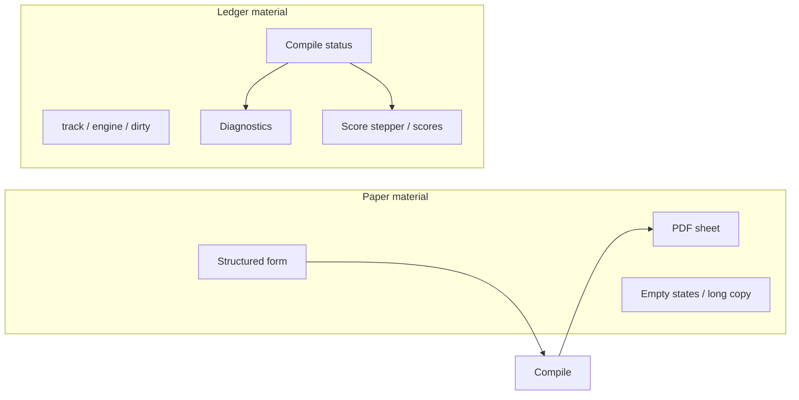

# DESIGN.md — ResumeAI visual & interaction system

| Field | Value |
|-------|--------|
| **Document** | Presentation-layer design system (companion to structure/product) |
| **Product** | ResumeAI rebuild workspace (`C:\Code\ResumeAI\rebuild`) |
| **Author** | Systems architecture / design agent |
| **Date** | 2026-08-02 |
| **Status** | **Approved** (rev 3 — write→review design skill loop, 0 open issues) |
| **Supersedes** | Prior workspace DESIGN drafts (AI-path chrome); salvage only from [`OLD-DESIGN.md`](./OLD-DESIGN.md) |
| **Structure SoT** | [`STRUCTURE.md`](./STRUCTURE.md) |
| **Product behavior SoT** | Live form-path pivot ([`LESSONS.md`](./LESSONS.md), `tests/test_form_path_pivot.py`, `workspaceMode.ts`) over seeded `docs/product/` / lagging product constraints where they conflict |
| **Implementation targets** | `frontend/src/index.css`, `theme.ts`, `App.tsx`, `Workspace.tsx`, `SettingsDrawer.tsx`, `toast.tsx`, `ThemeToggle.tsx` |

**Authority:** This file is the presentation SoT. Structure stays in STRUCTURE.md; do not treat OLD-DESIGN as equal authority.

---

## Overview

ResumeAI’s UI must look like a **typesetting + build tool**, not a gradient SaaS resume marketplace. The visual system pairs **paper** (warm surfaces, system-serif for reading accents, calm form rhythm) with **ledger** (monospace facts: track, engine, dirty/saved, diagnostics, score steps). This document is the binding **presentation** companion to structure and product docs: it owns tokens, type, motion, component character, and quality bar—not routes, create CTAs, or mode matrices.

The live product has completed a **form-path pivot**: list CTAs are **New resume** + **New LaTeX**; FORM_PATH is form-only (no Source tab, no AI Generate, no Lint); Compile is deterministic form→LaTeX+PDF with track staying `structured`; LATEX_ONLY keeps source + rule-based lint. Live CSS still uses generic slate/emerald SaaS tokens. This design realigns the thesis to that chrome, retires AI-primary presentation, and specifies implementable CSS variables and PR-sized frontend work so paper/ledger replaces emerald without inventing absent features.

---

## Background & Motivation

### Why update DESIGN

| Pressure | Detail |
|----------|--------|
| **Doc role confusion** | README/structure notes incorrectly treated DESIGN as “structure-only.” **STRUCTURE.md** owns IA/chrome inventory; **this DESIGN** owns taste/presentation **within** that chrome. |
| **Form-path pivot** | Current `DESIGN.md` still names **New AI resume**, primary **AI Generate**, dual Form\|Source, and `used_llm` toasts as everyday UX. Live truth (`LESSONS.md`, `workspaceMode.ts`, Playwright-captured STRUCTURE) supersedes those. |
| **CSS gap** | `frontend/src/index.css` uses cold slate (`#f8fafc` / `#0b1220`) and emerald accent (`#059669` / `#34d399`) with pill chips and multi-shadow cards—opposite of paper/ledger. |
| **Process rule** | skills-guide + `AGENTS.md`: **structure first, taste second**; product traps win over pure aesthetics. Taste polish must not reintroduce template pickers, free-form chat, auto-score, or AI Generate chrome. |
| **Lagging product copy** | Seeded `docs/product/` and some `AGENTS.md` product constraints still say “New AI resume” / AI Generate. **Implementers must not “fix” UI copy to match lagging docs**—follow LESSONS + form-path tests + this DESIGN + STRUCTURE. |

### Current state (facts)

- **Chrome inventory:** STRUCTURE §1–15 — auth, list, two-tier workspace, rail sections, settings drawer, structural absences.
- **Mode matrix:** `workspaceModeForTrack` — `structured` → FORM_PATH (form, no lint); `latex` → LATEX_ONLY (source + lint).
- **Theme plumbing:** `theme.ts` + `ThemeToggle` — `data-theme`, localStorage, diagonal wipe, `prefers-reduced-motion`.
- **Toasts:** `ToastKind = "ok" | "err"` only—no AI/fallback toast kinds in the live tree. Auto-dismiss always `ms = 3200` for both kinds (`toast.tsx`).
- **Rail:** three separate panels (Versions, Diagnostics if LATEX, ATS score)—**not** a unified compile-ledger transcript (OLD-DESIGN §3 was aspirational; STRUCTURE §8 is live).
- **Live focus token:** `--focus` is a **full `box-shadow` string** (`0 0 0 3px rgba(...)`), consumed as `box-shadow: var(--focus)` on inputs/buttons.
- **Live primary accident:** `Workspace.tsx` **Save** has no `.secondary` (default filled primary); Compile/Lint/PDF/Check score/Delete are `.secondary`. List **New resume** is filled; **New LaTeX** is `.secondary`.

### Pain points

1. Emerald/slate reads as generic admin SaaS; PDF sheet does not feel like the hero.
2. Design doc previously designed honesty UI for AI Generate as primary path → agents risk reintroducing chrome.
3. Hardcoded light-only colors remain (e.g. `.engine-chip`, `.version-row` borders, version action blues) and break dark theme coherence.
4. Pill `.chip` radii and multi-elevation panels dilute the “one lift = PDF” rule.
5. Naïve token rename of `--focus` color-type would kill focus rings; incomplete aliases leave `--chip` / `--shadow` / dark button ink broken.

---

## Goals & Non-Goals

### Goals

1. Specify a complete **paper + ledger** visual system implementable against the **live** STRUCTURE chrome.
2. Provide **concrete CSS custom properties** + a **complete legacy alias inventory** that can replace current `index.css` token blocks without breaking consumers.
3. Map presentation to **every live screen** (auth, list, FORM_PATH, LATEX_ONLY, PDF, settings, rail, toasts, score stepper).
4. Define **honest feedback** for save / compile / lint / score / GitHub cache / destructive—without AI Generate as primary UX.
5. Order a **PR plan** that migrates tokens and chrome character without breaking product structure or tests.
6. Keep WCAG AA (including **primary button pairs validated in PR1**), keyboard focus, and reduced-motion as first-class constraints.
7. Close **primary-action hierarchy** so implementers do not guess Save vs Compile fills.

### Non-Goals

- Backend / API / schema redesign; scoring engine changes; new generate backends.
- Reintroducing or designing chrome for: template picker, AI Generate primary CTA, permanent Form\|Source dual tabs, free-form coach/chat, auto-score, live GitHub-on-score, pdf.js/SyncTeX UI.
- Replacing the three-panel rail with a unified “compile ledger” transcript (would fight STRUCTURE; optional future only if product adopts it).
- Marketing illustrations, empty-state mascots, confetti, glassmorphism.
- Rewriting product docs/`PRD.md` in this effort (seeded docs may lag pivot; agents follow LESSONS + STRUCTURE + this DESIGN for presentation and create copy).
- Changing live workspace **grid track sizes** as part of token/character PRs (aspirational only; see Grid).
- Shipping branded webfonts as a PR1 requirement.

---

## Design premise / thesis

ResumeAI turns structured data (or pasted LaTeX) into a typeset document, then compiles and audits it. The interface should belong to the **same universe as the document**: typesetting (paper, serif accents, page shadow) and build tooling (monospace ledger, state as log lines).



### Principles (binding)

1. **The resume/PDF is the hero.** Only the PDF sheet gets meaningful elevation; application panels stay flat, separated by hairline rules.
2. **State is information, not decoration.** Track, engine, dirty/saved, lint severity, score steps are plain text + restrained color—never celebratory badges.
3. **One clear action per moment.** At most **one** filled primary control in a given region; see [Primary action hierarchy](#primary-action-hierarchy-binding).
4. **Calm density.** Fit a serious workspace; generous internal spacing and obvious grouping; never sparse empty marketing voids.
5. **Product traps as structural absences.** Do not design presentation for missing features. No ghost “AI Generate,” no disabled Form tab, no template gallery chrome.

Audience: software engineers comfortable with monospace, diffs, and state machines. Trust rises when the UI looks like a tool, not a consumer funnel.

---

## Foundations

### Color tokens

Two intentional themes—not inverted greys. Light = warm paper; dark = soft ink. Functional accents map to **states**, not brand fill everywhere.

| Token | Light (Paper) | Dark (Ink) | Use |
|-------|---------------|------------|-----|
| `--canvas` | `#F7F5F0` | `#121418` | App / `html, body, #root` background |
| `--surface` | `#FFFEFA` | `#1B1E24` | Panels, cards, inputs, drawers |
| `--surface-muted` | `#EFECE4` | `#15171C` | Rail, editor tab bar, form gutters, chip fill |
| `--text` | `#1D1D1A` | `#F1EFE9` | Primary text |
| `--text-muted` | `#716F67` | `#A5A5A1` | Labels, captions, group labels |
| `--rule` | `#DCD8CE` | `#30343C` | Borders, dividers |
| `--accent` | `#8B5219` | `#E3A55E` | Primary filled actions, active selection |
| `--accent-hover` | `#734315` | `#EBB56F` | Primary hover |
| `--accent-soft` | `#F3E8D8` | `#2A2418` | Soft selected/chip backgrounds |
| `--on-accent` | `#FFFFFF` | `#1A1814` | **Text/icons on filled primary** (theme-specific) |
| `--ok` | `#3F7555` | `#6DB38A` | Saved, compile success, score complete |
| `--build` | `#B07A2E` | `#E0A855` | Compiling / processing / dirty wash / in-flight |
| `--fallback` | `#776945` | `#A99769` | Reserved if generate honesty ever surfaces; **not** primary create UX |
| `--danger` | `#AB453C` | `#DF7167` | Errors, destructive outline/confirm |
| `--focus-color` | `#285B9C` | `#82B4F4` | Focus ring **color only** (never decorative fill) |
| `--focus` | `0 0 0 3px color-mix(in srgb, var(--focus-color) 45%, transparent)` | same pattern | **Full box-shadow string** — live consumer type preserved |
| `--input` | `#FFFEFA` | `#15171C` | Field fill |
| `--input-border` | `#DCD8CE` | `#30343C` | Field border |
| `--code-bg` | `#F3F0E8` | `#0E1014` | LaTeX source shell |
| `--code-fg` | `#1D1D1A` | `#E8E6E0` | Source text |
| `--code-selection` | `color-mix(in srgb, var(--accent) 22%, transparent)` | `color-mix(in srgb, var(--accent) 28%, transparent)` | Selection |
| `--pdf-mat` | `#6B6560` | `#3A3A38` | PDF iframe letterbox |
| `--shadow` | `none` | `none` | Default panels (prefer rule); see alias notes |
| `--shadow-pdf` | `0 14px 36px -14px rgb(0 0 0 / 35%)` | same / slightly stronger | **PDF sheet only** |
| `--shadow-drawer` | `-8px 0 24px rgb(0 0 0 / 8%)` | `-8px 0 24px rgb(0 0 0 / 28%)` | Settings drawer edge only |

Color is **never** sole meaning: always pair with label, glyph, or status copy.

#### Primary button AA (validated for PR1 — do not ship failing pairs)

Contrast computed against WCAG 2.x relative luminance (normal text ≥ 4.5:1 for button labels).

| Theme | Fill | Label | Approx ratio | AA normal text |
|-------|------|-------|--------------|----------------|
| Light | `#8B5219` (`--accent`) | `#FFFFFF` (`--on-accent`) | **~6.1:1** | **Pass** |
| Light (rejected weaker option) | `#9A5B1D` | `#FFFFFF` | ~5.4:1 | Pass but thin margin — **do not prefer** when `#8B5219` is available |
| Dark | `#E3A55E` (`--accent`) | `#1A1814` (`--on-accent`) | **~8.5:1** | **Pass** |
| Dark (forbidden) | `#E3A55E` | `#FFFFFF` | ~2.1:1 | **Fail** — never white labels on dark amber fill |

**PR1 acceptance (hard):** filled `button:not(.secondary):not(.link):not(.chip):not(.theme-toggle)` must use `color: var(--on-accent)` in **both** themes. Remove live dark override `color: #06281c` (emerald-tinted ink). Spot-check **New resume** and auth submit in light and dark.

Muted labels (`--text-muted` on `--surface`) and ledger at 12–13px remain a PR5 full audit; primary fill pairs must pass **in PR1**.

#### Live custom-property inventory (grep `var(--` in `index.css`)

Every live custom property and PR1 disposition:

| Live token | Live type / example | PR1 disposition |
|------------|---------------------|-----------------|
| `--accent` | color `#059669` / `#34d399` | **Replace** with paper/ink accent values |
| `--accent-hover` | color | **Replace** |
| `--accent-soft` | color | **Replace** |
| `--danger` | color | **Replace** with paper danger |
| `--panel` | color | **Alias** → `var(--surface)` |
| `--panel-muted` | color | **Alias** → `var(--canvas)` for page wash OR `var(--surface-muted)` for recessed chrome — **set to `var(--canvas)`** so `html,body,#root { background: var(--panel-muted) }` becomes paper canvas without editing every call site; recessed UI that currently uses `--panel-muted` for rails will get canvas tone (warm, acceptable). PR2/PR3 may re-point rail to `--surface-muted` explicitly. |
| `--border` | color | **Alias** → `var(--rule)` |
| `--text` | color | **Replace** with paper/ink text |
| `--muted` | color | **Alias** → `var(--text-muted)` |
| `--shadow` | box-shadow multi-layer | **Replace value with `none`** so existing `box-shadow: var(--shadow)` on `.card`/`.rail`/`.editor` goes flat without hunting every rule. Drawer keeps hardcoded/`--shadow-drawer`. PDF uses `--shadow-pdf` in PR4. |
| `--ok` | color | **Replace** |
| `--err` | color | **Alias** → `var(--danger)` (keep name for `.err` rules) |
| `--chip` | color | **Alias** → `var(--surface-muted)` |
| `--focus` | **box-shadow string** | **Keep as box-shadow string**; recolor via `--focus-color` inside the string. **Never** assign a bare color to `--focus`. |
| `--input` | color | **Replace** / point at surface |
| `--input-border` | color | **Alias** → `var(--rule)` |
| `--code-bg` | color | **Replace** |
| `--code-fg` | color | **Replace** |
| `--code-selection` | color | **Replace** (prefer mix from accent) |
| `--canvas`, `--surface`, `--surface-muted`, `--rule`, `--text-muted`, `--build`, `--fallback`, `--focus-color`, `--on-accent`, `--pdf-mat`, `--shadow-pdf`, `--shadow-drawer` | new | **Introduce** |

Also set on `:root` / `[data-theme]`:

- `color: var(--text)` (replace hardcoded slate hex)
- `background: var(--canvas)` on the theme block **and** ensure `html, body, #root` use `background: var(--canvas)` or `var(--panel-muted)` after alias equals canvas

#### `--focus` migration (critical — do not break rings)

Live consumers (must keep working in PR1):

```css
input:focus,
textarea:focus,
button:focus-visible {
  box-shadow: var(--focus);
}
/* also structured-form fields */
```

**Required PR1 pattern (option A — preferred, zero consumer edits):**

```css
:root, [data-theme="light"] {
  --focus-color: #285b9c;
  /* TYPE MUST REMAIN box-shadow — matches live API */
  --focus: 0 0 0 3px color-mix(in srgb, var(--focus-color) 45%, transparent);
}
[data-theme="dark"] {
  --focus-color: #82b4f4;
  --focus: 0 0 0 3px color-mix(in srgb, var(--focus-color) 40%, transparent);
}
```

**Forbidden in PR1:** `--focus: #285b9c;` while any rule still does `box-shadow: var(--focus)`.

**Optional later (PR5 only if desired):** introduce dual-ring `--focus: 0 0 0 2px var(--surface), 0 0 0 4px var(--focus-color);` still as a **shadow string**, same consumers.

### Typography

| Role | MVP stack (binding for PR1–PR5) | Optional later webfonts |
|------|----------------------------------|-------------------------|
| **Document** | `ui-serif, Georgia, "Times New Roman", serif` | Source Serif 4 |
| **Interface** | `"Segoe UI", system-ui, sans-serif` (live default) | Inter |
| **Ledger** | `ui-monospace, "Cascadia Mono", Consolas, "Courier New", monospace` | JetBrains Mono |

- Scale (px): `12 / 13 / 15 / 17 / 21 / 28 / 40`.
- Default UI body: **15px**; labels/ledger metadata: **13px**; list page title: **28px** max; workspace title input: **~17–21px** compact.
- Ledger never larger than 15px for log-like rows.
- Document role is an **accent for empty-state sentences** via a CSS class (e.g. `.text-document { font-family: ui-serif, … }`) — **not** a webfont load gate. Empty states must not block on font network.

**Key Decision:** MVP ships **system stacks only**. Branded webfonts are an optional polish PR after visual sign-off—not PR1.

### Space, shape, depth

| Token | Value |
|-------|--------|
| Spacing scale | `4 / 8 / 12 / 16 / 24 / 32 / 48` px |
| Workspace gutter | 16px |
| Page padding (list/auth) | 24–32px desktop |
| Radius surface/control | **6px** |
| Radius ledger chip / diag | **2px** |
| Radius filter tag chips | **6px** (not full pill `999px`) |
| Panel separation | 1px `--rule`, flat |
| Elevation | **PDF only** (`--shadow-pdf`); drawer uses `--shadow-drawer`; default `--shadow: none` |
| Focus | `box-shadow: var(--focus)` with `--focus` as ring **string** built from `--focus-color` |

**No pill buttons.** Live `.chip { border-radius: 999px }` → ~6px in PR2; track chips stay square-ish 2–4px.

### Grid (presentation targets matching STRUCTURE)

**Binding (live — do not change in PR1–PR4 without an explicit layout PR):**

```css
/* frontend/src/index.css — keep unless layout PR + laptop gate */
grid-template-columns: minmax(11rem, 13rem) minmax(16rem, 1fr) minmax(16rem, 1fr);
```

**Aspirational only (non-binding):** rail ~220–260px · editor `minmax(440px, 1fr)` · PDF `minmax(360px, 0.85fr)`. Implementers **must not** expand tracks in character PRs. If pursued later: dedicated layout PR with hard gate “revert if ≤1280px workspace unusable.”

Below ~900px: stack columns (live behavior); editor + PDF remain priority.

---

## Application character

### Header and navigation

**Auth:** `main.shell.auth` — centered narrow column; wordmark text-led “ResumeAI”; muted mode line; ThemeToggle in header. No illustrations.

**List:** `main.shell.wide` — masthead: “Your resumes”, count/muted copy, `header-actions`: ThemeToggle · Settings · Log out. Not a marketing navbar.

**Workspace two-tier** (STRUCTURE §5):

1. **Identity row** — back, Settings, ThemeToggle, title input, track-chip, engine-chip, dirty/saved-chip, tags.
2. **Action row** — `role="toolbar"` groups File | Build | Score | Danger with uppercase `.group-label` in muted ledger style.

Hairline rules between tiers; **do not card each toolbar group**. Continuous, scannable toolbar.

### Chips and system facts (ledger)

| Chip | Content (live) | Treatment |
|------|----------------|-----------|
| Track | `structured` \| `latex` | Ledger mono, 2px radius, muted surface + rule; **not** emerald success paint |
| Engine | engine name or `—` | Ledger; after compile only meaningful; **tokenize** live light-only blues |
| Dirty | `Unsaved` | Soft **`--build`** wash + text (replace live `#fbbf24` mixes) |
| Saved | `Saved` | Soft ok wash + text label |
| Tag filters | user tags | Interface face, 6px radius, outline when inactive |

Facts, not badges. Prefer restrained text over loud filled status. Score **processing** / compile **in-flight** share the same `--build` semantic channel as dirty wash.

### Primary action hierarchy (binding)

Closes former Open Question on Save vs Compile. Live bug: **Save** is always filled primary; **Compile** is secondary—violates “one clear action” when both dirty and “needs PDF” compete visually.

#### Rules (v1 — implement in PR3)

| Region | Primary (filled `--accent` + `--on-accent`) | Secondary |
|--------|-----------------------------------------------|-----------|
| **List** | **New resume** only | **New LaTeX**, Settings, Log out, filters, Delete |
| **Auth** | Submit (**Continue** / **Create account**) | Theme, switch link |
| **Workspace toolbar** | **At most one** of Save or Compile per rules below | Everything else always `.secondary` (Lint, PDF, Check score, .tex, Delete, Commit) |

**Workspace dynamic primary (exactly one algorithm):**

```
if dirty:
  Save = primary
  Compile = secondary
else if !pdfUrl OR pdfStale:
  Compile = primary
  Save = secondary
else:
  Save = secondary
  Compile = secondary
```

- **Dirty wins over stale:** persist first, then compile—matches safe document workflow.
- **Never** fill both Save and Compile.
- **Never** promote Check score / Lint / Delete to filled primary.

#### `pdfStale` — not live today; PR3 adds it (presentation state only)

**Live fact (`Workspace.tsx` today):** there is **no** `pdfStale` state, no “stale” status string, and no stale chip. Live state is only `dirty`, `pdfUrl`, `pdfBusy`, `engine`, plus debounced auto-recompile when `engine && dirty` (~1.2s). Do **not** claim the product already surfaces stale PDF status.

**Broken proxy (do not use):** `(dirty && !!pdfUrl) || !pdfUrl` collapses to “Compile primary only when `!pdfUrl`” once the user Saves (`dirty → false`) while an outdated blob is still showing—so clean + outdated PDF never promotes Compile. That fails the algorithm’s clean+stale branch.

**PR3 requirement — add explicit local state** (few lines; not a product feature beyond reflecting “preview may not match editor”):

```ts
// presentation-only UI state — not a backend field
const [pdfStale, setPdfStale] = useState(false);

function markDirty() {
  setDirty(true);
  // If a preview blob already exists, edits invalidate it until next successful compile
  if (pdfUrl) setPdfStale(true);
}

// clear on successful compile path (manual Compile and successful auto-preview refresh)
// after refreshPdfPreview() succeeds following compile:
setPdfStale(false);

// optional: on failed compile, leave pdfStale true if a blob remains (still outdated vs editor)
```

| Event | `pdfStale` |
|-------|------------|
| Initial load / no PDF yet | `false` (`!pdfUrl` already drives Compile primary) |
| `markDirty()` while `pdfUrl` set | → `true` |
| `markDirty()` while no `pdfUrl` | leave `false` (empty pane copy covers it) |
| Successful compile + `refreshPdfPreview` | → `false` |
| Successful auto-recompile path (live debounce) | → `false` when preview refresh succeeds |
| Save only (`persistIfNeeded` / `onSave`) | **does not** clear `pdfStale` (blob may still be outdated) |
| Failed compile / failed auto-preview | leave prior value (usually stay `true` if was stale) |

**Why still needed despite live auto-recompile:** auto-preview runs only when `engine && dirty` and can fail silently; after Save, `dirty` is false while the blob may still match pre-edit content until the next successful compile. Explicit `pdfStale` keeps Compile primary in that window without inventing backend fields or new product journeys.

**Optional presentation (add if useful — not “already live”):** muted PDF-pane line when `pdfUrl && pdfStale && !pdfBusy`, e.g. *“Preview may be outdated — Compile to refresh.”* Restyle-only; do not change the empty-state no-pdf.js string. Identity row need not gain a new chip unless hierarchy alone is insufficient.

**PR3 files:** `Workspace.tsx` — (1) `pdfStale` state + set/clear hooks above, (2) Save/Compile `className` from hierarchy algorithm, (3) optional muted stale line under PDF. CSS for chips/form/source as listed.

### Buttons

| Kind | Appearance | Use under hierarchy |
|------|------------|---------------------|
| **Primary** | `background: var(--accent); color: var(--on-accent); border-color: var(--accent)` | List New resume; auth submit; workspace Save **or** Compile per algorithm |
| **Secondary** | Surface + `--rule` border, `--text` | New LaTeX, remaining toolbar, Settings GitHub actions |
| **Tertiary / link** | Text-only | Back, restore, filter clear, auth switch |
| **Destructive** | Outline `--danger` | Delete; solid danger only on final confirm if introduced |

Equal-class create journeys as products: **never** label either CTA “recommended.” Do not style New LaTeX as de-emphasized tertiary.

### Toasts

- Host: fixed bottom-right (live `.toast-host`).
- Shape: surface + 1px rule; **left accent rule or small glyph** for ok/err—not large color blocks.
- Radius: 6px (not 10px “cardy”).
- **ok:** auto-dismiss ~3.2s (live default).
- **err:** longer persistence or no auto-dismiss — **behavior change in `toast.tsx`**, not CSS. **Ship in PR5** (a11y/behavior). PR2 only restyles toast appearance; do not claim err-duration done in CSS-only PR2.
- Copy voice: ledger-register—what happened, no “Oops 😬”.

---

## Screen direction (mapped to STRUCTURE)

### Auth (`/login`, `/register`) — STRUCTURE §2

- Ample `--canvas` around a single `--surface` form.
- Fields: Email, Password (register: “Password (≥ 8)”).
- One submit: **Continue** | **Create account** (primary).
- Footer link switches mode.
- ThemeToggle always present.
- Focus order: email → password → submit → switch link → theme.

### Resume list (`/`) — STRUCTURE §3

```
Header (title + count + Theme/Settings/Logout)
CTA row: [ New resume ] [ New LaTeX ]
Filters (search + tag filters) — low contrast band, not oversized marketing card
Empty: document-role one-liner (system serif) + muted instruction + same two CTAs
List: typographic rows — title · track chip · tags · Delete
```

- Prefer **rows** (live `ul.resume-list`) over dashboard card grids (OLD-DESIGN card grid is **not** live).
- Hover: subtle surface tint; no lift/bounce.
- Empty copy example:  
  *“No resumes yet.”* / muted: *“Start from a form, or bring your own LaTeX.”*

### FORM_PATH workspace — STRUCTURE §6

| Region | Presentation |
|--------|----------------|
| Identity | track `structured`; engine `—` until compile; form remains editable after compile |
| Toolbar | File: Save, .tex (disabled until snapshot); Build: **Compile**, PDF — **no Lint**; Score: Check score; Danger: Delete — primary per hierarchy |
| Editor | Static label **Form** (`.tab.static`—not fake dual tabs); structured sections Basics → Work → Education → Projects → Skills |
| Rail | Versions + ATS score only (**no Diagnostics**) |
| PDF | Empty until Compile (live empty copy); after edits with a blob, optional muted “may be outdated” line via PR3 `pdfStale` (not live today)—not red panic |

Form rhythm: section rules, muted labels, 2-col field grid on desktop, reordering compact secondary controls. Contact links live **on the form**, not Settings.

### LATEX_ONLY workspace — STRUCTURE §7

| Region | Presentation |
|--------|----------------|
| Identity | track `latex` |
| Toolbar | Build includes **Lint** (always secondary) |
| Editor | Static **LaTeX source**; monospace source shell (`--code-*`); soft-wrap |
| Rail | Versions + **Diagnostics** + ATS score |
| PDF | Same iframe preview rules |

Lint rows: ledger face, severity glyph (`✕` / `!`) + optional `L{n}` + message; click may jump status/editor. Empty diagnostics: *“Run Lint for issues and fix hints.”*

### PDF pane — STRUCTURE §9

- Heading **PDF**.
- Busy: *“Updating…”* (compact, under heading).
- Empty — **keep live product-honest string (do not truncate):**  
  `Click Compile for iframe preview (blob URL; no pdf.js).`  
  Design may restyle only; **do not** “clean up” the anti-pdf.js clause unless product explicitly shortens it.
- Ready: iframe `title="Resume PDF preview"` blob URL; sheet on `--pdf-mat`; hero elevation via `--shadow-pdf` in PR4.
- **Stale (PR3 presentation, not live today):** when `pdfUrl && pdfStale && !pdfBusy`, optional muted line *“Preview may be outdated — Compile to refresh.”* Does not replace empty copy; no new chrome chrome patterns.
- **No** pdf.js, SyncTeX, or multi-page chrome beyond browser iframe behavior.

### Settings drawer — STRUCTURE §10

- Right drawer + dim overlay; Escape / overlay click closes.
- Sections: **Account** (email, note contact links on form) · **GitHub (for scoring)** (username, Save, **Update GitHub data**, cache status) · **Log out**.
- **Theme is not in the drawer** (ThemeToggle on shell only)—do not restyle Settings to include theme radios (OLD-DESIGN conflict).

### Rail sections — STRUCTURE §8

Three quiet panels separated by rules—not one terminal transcript:

1. **Versions** — message input + Commit; rows: message · time · Restore · Delete.
2. **Diagnostics** — LATEX_ONLY only.
3. **ATS score** — ordered stepper + manual-only idle copy + overall/categories + weak-GitHub hint → Settings.

Presentation: ledger for numerals/status; interface for human commit messages (slight face break so messages stand out). Processing step uses `--build` (same channel as dirty).

---

## Honest feedback & states

No AI Generate primary path. No fake “Generated with AI” toasts. **PR descriptions must never frame work as “AI Generate polish.”**

| Situation | Presentation | Do not |
|-----------|--------------|--------|
| **Save** | Identity chip `Unsaved` → `Saved`; optional status-line; Save may be filled primary when dirty | Celebratory spam toasts on every keystroke |
| **Compile success** | Engine chip updates; PDF refreshes; status “compiled / form still editable” (FORM_PATH); toast ok if used | Blank entire workspace |
| **Compile fail** | status-line err + readable first line; technical detail secondary | Cartoon error art |
| **PDF stale** | **PR3 adds** `pdfStale` (not live today). Optional muted PDF line; Compile primary when clean+stale. Live auto-recompile may clear it after success—do not invent auto-compile UX | Claiming stale UI already ships; replacing empty no-pdf.js copy |
| **.tex download** | Enabled only after last successful compile snapshot | Implying live form is the .tex without compile |
| **Lint** | Diagnostics list fills; empty until run | Showing Lint on FORM_PATH |
| **Score idle** | Stepper idle + *“Manual Check score only — never auto after edits.”* | Auto “Scoring…” after compile |
| **Score running** | Queued → Processing (`--build`) → Complete (`--ok`) / Failed (`--danger`) | Confetti on complete |
| **Score result** | Overall `/100` ledger-large; categories with evidence text | Color-only bands without numbers |
| **Score failed** | Failed step + error text | Silent failure |
| **GitHub cache** | Cache status line + timestamp; Update is secondary outline | Implying live GitHub on score |
| **Destructive** | `window.confirm` or compact dialog naming resume/checkpoint | Solid red primary on first click |
| **Generate honesty** | **Out of primary UX.** If a backend path ever returns `used_llm`, use `--ok` vs `--fallback` **distinct** copy—never imply AI when fallback. Do not ship Generate CTA. | AI branding on form path |

Voice table (ledger register):

| Situation | Do | Don’t |
|-----------|----|--------|
| Compile failed | “Compile failed — tectonic exited with an error.” | “Oops! Something went wrong 😬” |
| Score timeout | “Score job timed out. Try again.” | “This is taking longer than expected…” |
| Version no-op | “No changes since last commit.” | “Nothing to save!” |
| GitHub stale | “Cache last updated 3h ago.” | Silent stale use with no timestamp |

---

## Motion & interaction

| Motion | Spec | Notes |
|--------|------|--------|
| Hover/focus transitions | 120–160ms ease-out | Opacity/color/border |
| Theme wipe | ~400–520ms diagonal wipe (live `.theme-wipe`) | Cosmetic only; tokens flip same tick (`ThemeToggle`); tint toward paper/ink |
| Drawer/modal | 180–220ms ease-out opacity/transform | No elastic bounce |
| Toast in | ~150–350ms short rise | Live has toast-in; keep subtle |
| PDF refresh | Cross-fade or “Updating…” | Don’t white-flash whole app |
| Score steps | Instant or single fade | No typewriter |
| Button active | Optional scale 0.98 | Kill if it feels toy-like under paper thesis |

**`prefers-reduced-motion: reduce`:** wipe `display: none`; transitions effectively none; toast animation off (live already partially implements).

**Keyboard:** predictable tab order; visible `box-shadow: var(--focus)`; Escape closes settings; every icon-only control has accessible name (ThemeToggle already has `aria-label`). Toolbar groups remain focusable buttons in DOM order File→Build→Score→Danger.

---

## Quality bar & exclusions

### Accept when

- [ ] **PR1:** primary button pairs pass AA (table above); `--on-accent` wired both themes.
- [ ] **PR1:** `--focus` remains a box-shadow string; rings still visible on input/button focus.
- [ ] **PR1:** full alias inventory applied (`--chip`, `--shadow`, `--panel*`, `--err`, body/canvas).
- [ ] WCAG AA contrast for body, muted labels, disabled controls, ledger at 12–13px (full audit by PR5).
- [ ] Both themes intentional; PDF remains readable; form inputs respect `color-scheme`.
- [ ] Action hierarchy matches [Primary action hierarchy](#primary-action-hierarchy-binding); never dual filled Save+Compile; **`pdfStale` exists as PR3-added local state** (not claimed as pre-existing live).
- [ ] Status always has text; color not sole channel.
- [ ] STRUCTURE absences still absent in DOM (no template picker, no AI Generate, no dual Form\|Source, no coach).
- [ ] **Hard gate:** `uv run --project backend pytest tests/test_form_path_pivot.py -q` green **and** frontend source must not gain strings `AI Generate` or `New AI resume` (already asserted by tests). Do not “fix” App/Workspace copy to match lagging `docs/product/`.
- [ ] No emerald/slate residual as primary brand after token PR.
- [ ] Hardcoded light-only hex in workspace CSS removed or tokenized (`.engine-chip`, `.version-row`, version links).
- [ ] Dirty/processing washes use `var(--build)` (PR3).
- [ ] PDF empty copy retains anti-pdf.js clause.

### Explicit exclusions (structural + aesthetic)

| Exclusion | Why |
|-----------|-----|
| Template gallery | Product trap |
| AI Generate chrome | Form-path pivot |
| Fake dual tabs | Live is static mode label |
| Free-form chat / coach | Out of scope |
| Auto-score UI | Manual only |
| Live GitHub-on-score affordance | Settings cache only |
| pdf.js / SyncTeX UI | iframe blob only |
| Pill buttons, glass, neon, gradients as brand | Thesis |
| Unified compile-ledger rail as requirement | Fights STRUCTURE §8/12 |
| “Recommended” create path styling | Both journeys first-class |
| Celebratory AI badges | No primary generate path |
| Expanding grid tracks in style PRs | STRUCTURE/live sizes binding |

Finished effect: **quiet confidence**—a tool composed as carefully as the resume it helps create.

---

## Implementation mapping

| Concern | Primary files | Change nature |
|---------|---------------|---------------|
| Token definitions + aliases | `frontend/src/index.css` `:root` / `[data-theme="dark"]` | Paper/ink values; full inventory; focus string preserved |
| Body/canvas | `html, body, #root` | `background: var(--canvas)` or aliased `--panel-muted` |
| Filled button label | `button` + dark theme rule | `color: var(--on-accent)`; delete `#06281c` |
| Global type | `index.css` only for MVP | system stacks; optional `.text-document` |
| Auth / list chrome | `App.tsx` + `index.css` | CSS character; **do not** rename CTAs to “New AI resume” |
| Workspace hierarchy + `pdfStale` | `Workspace.tsx` + `index.css` | PR3: explicit `pdfStale` state (not live today) + Save/Compile className; optional muted PDF line |
| Mode matrix | `workspaceMode.ts` | **No visual redesign** |
| Settings | `SettingsDrawer.tsx` + drawer CSS | Flat sections; `--shadow-drawer` |
| Toasts visual | `index.css` `.toast*` | PR2 appearance |
| Toasts err duration | `toast.tsx` | **PR5** only |
| Theme | `theme.ts`, `ThemeToggle.tsx` | Keep API; restyle wipe |
| PDF frame | `.pdf-frame`, `.pdf-pane` | PR4 hero; empty copy unchanged |
| Hardcoded colors | `.engine-chip`, `.version-row`, `.version-actions .link`, `.dirty-chip` | Tokenize; dirty → `--build` |
| Tests | `theme.test.ts`, `workspaceMode.test.ts`, form-path pytest | No behavior break |

### Suggested CSS shape (PR1-correct)

```css
:root,
[data-theme="light"] {
  color-scheme: light;
  color: var(--text);
  background: var(--canvas);

  --canvas: #f7f5f0;
  --surface: #fffefa;
  --surface-muted: #efece4;
  --text: #1d1d1a;
  --text-muted: #716f67;
  --rule: #dcd8ce;
  --accent: #8b5219; /* AA ~6.1:1 with white */
  --accent-hover: #734315;
  --accent-soft: #f3e8d8;
  --on-accent: #ffffff;
  --ok: #3f7555;
  --build: #b07a2e;
  --fallback: #776945;
  --danger: #ab453c;
  --focus-color: #285b9c;
  /* CRITICAL: box-shadow string, not a bare color */
  --focus: 0 0 0 3px color-mix(in srgb, var(--focus-color) 45%, transparent);

  --input: var(--surface);
  --input-border: var(--rule);
  --code-bg: #f3f0e8;
  --code-fg: var(--text);
  --code-selection: color-mix(in srgb, var(--accent) 22%, transparent);
  --pdf-mat: #6b6560;
  --shadow-pdf: 0 14px 36px -14px rgb(0 0 0 / 35%);
  --shadow-drawer: -8px 0 24px rgb(0 0 0 / 8%);

  /* Legacy aliases — every live var(--*) consumer */
  --panel: var(--surface);
  --panel-muted: var(--canvas);
  --border: var(--rule);
  --muted: var(--text-muted);
  --err: var(--danger);
  --chip: var(--surface-muted);
  --shadow: none;
}

[data-theme="dark"] {
  color-scheme: dark;
  color: var(--text);
  background: var(--canvas);

  --canvas: #121418;
  --surface: #1b1e24;
  --surface-muted: #15171c;
  --text: #f1efe9;
  --text-muted: #a5a5a1;
  --rule: #30343c;
  --accent: #e3a55e;
  --accent-hover: #ebb56f;
  --accent-soft: #2a2418;
  --on-accent: #1a1814; /* never white on this fill */
  --ok: #6db38a;
  --build: #e0a855;
  --fallback: #a99769;
  --danger: #df7167;
  --focus-color: #82b4f4;
  --focus: 0 0 0 3px color-mix(in srgb, var(--focus-color) 40%, transparent);

  --input: #15171c;
  --input-border: var(--rule);
  --code-bg: #0e1014;
  --code-fg: #e8e6e0;
  --code-selection: color-mix(in srgb, var(--accent) 28%, transparent);
  --pdf-mat: #3a3a38;
  --shadow-drawer: -8px 0 24px rgb(0 0 0 / 28%);

  --panel: var(--surface);
  --panel-muted: var(--canvas);
  --border: var(--rule);
  --muted: var(--text-muted);
  --err: var(--danger);
  --chip: var(--surface-muted);
  --shadow: none;
}

html, body, #root {
  background: var(--canvas);
  color: var(--text);
}

button:not(.secondary):not(.link):not(.chip):not(.theme-toggle):not(.tab):not(.danger) {
  background: var(--accent);
  border-color: var(--accent);
  color: var(--on-accent);
}

/* DELETE live rule that forces dark emerald ink:
   [data-theme="dark"] button:not(...) { color: #06281c; }
*/
```

PR1 stays **CSS-variable-only** (plus deleting/replacing the dark button color override in the same CSS file). No JSX required for tokens—rollback = revert CSS.

### Component character checklist (no new product components)

- Buttons: primary vs `.secondary` vs `.danger` vs `.link` — hierarchy algorithm in PR3 JSX.
- Track/dirty/engine chips — restyle; dirty → `--build`.
- Score stepper `.score-step.active|done|failed` — `--build` / `--ok` / `--danger`.
- Do not add Generate button, dual tabs, or template modal “for completeness.”

---

## Alternatives Considered

### A0 — Leave DESIGN.md AI-path stale; ship emerald CSS forever

| Pros | Cons |
|------|------|
| Zero work | Dual SoT; agents reintroduce AI chrome; visual thesis never lands |

**Reject** for doc hygiene and product-intent risk.

### A1 — Keep emerald/slate; polish spacing only

| Pros | Cons |
|------|------|
| Minimal diff; low risk | Fails design thesis; still generic SaaS |
| No font loads | Does not close gap vs paper/ledger |

**Reject** as primary direction: tokens are the core of this design update.

### A2 — Adopt OLD-DESIGN “compile ledger” single rail + card list + AI toast system

| Pros | Cons |
|------|------|
| Strong signature element; rich honesty UI for generate | **Fights STRUCTURE**; reintroduces AI Generate presentation; large JSX rewrite |
| Memorable | Violates form-path pivot and “structure first” |

**Reject** for this document. Salvage tokens/motion/voice only.

### A3 — Paper/ledger tokens + CSS-first restyle of live STRUCTURE chrome (chosen)

| Pros | Cons |
|------|------|
| Aligns pivot + STRUCTURE; small blast radius; alias-friendly | Less “signature theater” than unified ledger rail |
| Implementable in ordered PRs; tests mostly green without product changes | Requires discipline not to “improve” chrome by adding features; PR3 needs small Save/Compile className logic |

**Accept.** Optional future: product-owned rail transcript redesign **after** explicit STRUCTURE/product change—not as taste PR.

### A4 — Tailwind-only redesign / new component library

| Pros | Cons |
|------|------|
| Fashionable | New dependency surface; rebuild frontend is plain CSS; ponytail forbids unnecessary deps |

**Reject** for MVP design application.

### A5 — Token rename-only without character PR

| Pros | Cons |
|------|------|
| Smaller first PR | Leaves pills, multi-elevation cards, accidental Save primary |

**Reject as complete solution**; PR1 token rename is step one of A3, not the end state.

---

## Security, privacy & accessibility

| Topic | Notes |
|-------|--------|
| **Auth forms** | Email/password only; no third-party widgets; autocomplete-friendly labels; errors via `role="alert"`. |
| **Session** | Theme in localStorage only; no secrets in CSS/design tokens. |
| **Destructive** | Confirm before delete resume/version; danger styling only after intent clear. |
| **Untrusted content** | Resume titles/tags/JD/diagnostics text rendered as text; no design that injects HTML from model output. |
| **Focus** | `--focus-color` distinct from `--ok` / `--danger` / `--build`; `--focus` shadow string preserved for consumers. |
| **Color-not-only** | Score bands, lint severity, toast kinds always include text/glyphs. |
| **Contrast** | Primary pairs validated in PR1; full muted/ledger audit by PR5. |
| **Motion** | Respect `prefers-reduced-motion` for wipe and toast. |
| **Hit targets** | Compact toolbar buttons ≥ ~28px height. |

---

## Observability

Presentation layer does not add product metrics backends. Practical hooks:

- Keep existing status-line + toast as user-visible signals for compile/score failures.
- Avoid animation that obscures error text.
- Design does not rely on color-only failure states.

**Rollback:** PR1 is CSS-variable-only (with correct `--focus` type and aliases) → revert file restores emerald and rings. JSX hierarchy (PR3) and toast duration (PR5) are small, isolated reverts.

---

## Rollout Plan

1. **PR1 Token alias** — paper/ink + full inventory; AA primary pairs; focus string; canvas; `--shadow: none`; no JSX.
2. **PR2 Chrome character** — radii, chips, list/auth, toast **appearance** only.
3. **PR3 Workspace** — chips, form/source, **Save/Compile hierarchy**, `--build` dirty, tokenize hardcoded hex; **no grid width expansion**.
4. **PR4 Rail / score / PDF / settings** — hero PDF, score colors, drawer shadow token.
5. **PR5 Motion / a11y / toast err duration** — focus polish, reduced-motion, contrast sweep, `toast.tsx` err `ms`.
6. **Regression** — form-path hard gate + full suite + `npm run build` + theme matrix.

**Feature flags:** not required.

**Risk register**

| Risk | Severity | Mitigation |
|------|----------|------------|
| `--focus` type change kills rings | **Critical** | PR1 keeps shadow string; documented pattern |
| Incomplete aliases (`--chip`, `--shadow`) | High | Full inventory table; PR1 acceptance grep |
| Amber primary AA fail | High | Ship `#8B5219` + `--on-accent`; dark never white-on-amber; PR1 gate |
| Dual filled Save+Compile | Med | Binding hierarchy algorithm in PR3 |
| Agents re-add AI Generate from old docs | High | Hard gate form-path test + string ban; do not match lagging product docs |
| Grid width scope creep | Med | Live tracks binding; aspirational only |
| Font FOIT / empty-state block | Low | System stacks only MVP |
| Over-scoping unified ledger rail | Med | Non-goal; STRUCTURE wins |

---

## Key Decisions

1. **Doc split is binding:** STRUCTURE = IA/chrome inventory; DESIGN = presentation; LESSONS + form-path tests = create-path behavior over lagging product docs.
2. **Form-path pivot is live presentation truth:** CTAs **New resume** + **New LaTeX**; no AI Generate chrome; FORM_PATH form-only; Compile deterministic; track stays structured; LATEX_ONLY has Lint + Diagnostics.
3. **Paper + ledger materials retained**; emerald/slate SaaS palette is deprecated.
4. **`--focus` remains a box-shadow string** recolored via `--focus-color`; never a bare color while consumers use `box-shadow: var(--focus)`.
5. **Full legacy alias inventory** including `--chip`, `--shadow: none`, `--panel`/`--panel-muted`, `--err`, body → canvas, dark `--on-accent`.
6. **Primary AA ships in PR1:** light `#8B5219` + white; dark `#E3A55E` + `#1A1814`; white-on-dark-amber forbidden.
7. **Primary hierarchy (v1):** list New resume + auth submit filled; workspace **at most one** of Save (if dirty) or Compile (if clean and `!pdfUrl || pdfStale`); never both; never score/lint/delete primary. **`pdfStale` is PR3-added local UI state**—live Workspace has no such flag; do not use the broken `dirty∧pdfUrl` proxy.
8. **MVP system fonts only** (ui-serif / system-ui / ui-monospace); branded webfonts optional later.
9. **Live grid tracks binding** for style PRs; wider rail aspirational only.
10. **Toast err longer duration is PR5 + `toast.tsx`**, not CSS-only PR2.
11. **PDF empty copy keeps** `(blob URL; no pdf.js)` clause.
12. **Dirty/processing share `--build`**.
13. **PDF is the only elevated surface;** panels flat (`--shadow: none`); drawer exception.
14. **No pill buttons;** ledger chips ~2px; surfaces ~6px.
15. **Rail stays three panels** per STRUCTURE.
16. **Theme stays shell ThemeToggle.**
17. **CSS-first aliases** preferred over mass JSX rename; PR3 hierarchy is the intentional small JSX exception.
18. **`used_llm` honesty** contingency only—not primary UX; no “AI Generate polish” PR framing.
19. **Motion budget:** theme wipe + short ease-out; reduced-motion respected.
20. **Implementation order:** tokens → global chrome → workspace hierarchy → rail/PDF → a11y/toast (PR Plan).

---

## Open Questions

1. **Seeded `docs/product/` / AGENTS product constraints lag:** owners should update traps/CTAs to “New resume” and drop AI Generate as primary journey when convenient. **Not blocking presentation implementation**—fail-closed on form-path tests instead.

*(Font loading, primary hierarchy, `pdfStale` PR3 flag, and empty-state serif are **closed** in Key Decisions / hierarchy section. Proxy vs flag: **flag only**—proxy rejected.)*

---

## PR Plan

Ordered frontend PRs against the live rebuild app. Each PR keeps structure/tests green; no feature reintroduction; **no PR titled or described as AI Generate work**.

### PR1 — Paper/ink tokens + full legacy aliases + AA primary

| | |
|--|--|
| **Title** | `style: paper/ink tokens, aliases, AA primary, preserve --focus shadow` |
| **Files** | `frontend/src/index.css` only (token blocks, `html/body/#root`, default `button` color via `--on-accent`, remove dark `#06281c` rule, theme-wipe tints) |
| **Deps** | None |
| **Description** | Replace emerald/slate values with paper/ink. Introduce `--canvas`, `--surface`, `--on-accent`, `--focus-color`, `--build`, etc. **Keep `--focus` as box-shadow string.** Alias `--panel`, `--panel-muted`→canvas, `--border`, `--muted`, `--err`, `--chip`, `--shadow: none`. Set body/root to canvas. **Acceptance:** primary button contrast per table; focus rings still appear on tab; `grep` shows no bare-color `--focus:`; theme toggle light/dark on auth/list/workspace. **No JSX.** |

### PR2 — Global chrome character (auth, list, chips, toast appearance)

| | |
|--|--|
| **Title** | `style: paper chrome for auth, list, chips, toast surfaces` |
| **Files** | `frontend/src/index.css` (`.shell`, `.card`, `.cta-row`, `.chip`, `.track-chip`, `.toast*`, radii); skim `App.tsx` only if class hooks needed |
| **Deps** | PR1 |
| **Description** | Flatten cards via `--shadow: none` already; radius 6px; de-pill chips; ledger track chips; toast left-rule **appearance**. Empty state may use `.text-document` system serif. **Does not** change `toast.tsx` err duration (that is PR5). Do not rename CTAs. |

### PR3 — Workspace hierarchy, `pdfStale`, identity, form/source, `--build` chips

| | |
|--|--|
| **Title** | `style: workspace paper/ledger + Save/Compile primary hierarchy` |
| **Files** | `frontend/src/index.css` (workspace, chips, form, source, version hex fixes); **`frontend/src/Workspace.tsx`** (`pdfStale` state, Save/Compile className, optional PDF muted line) |
| **Deps** | PR1 (ideally after PR2) |
| **Description** | Implement [Primary action hierarchy](#primary-action-hierarchy-binding). **Add** `const [pdfStale, setPdfStale]` — set `true` in `markDirty()` when `pdfUrl` is set; clear `false` after successful compile + `refreshPdfPreview` (manual and auto-preview paths). **Do not** claim this exists live; **do not** use `(dirty && pdfUrl) \|\| !pdfUrl` proxy. Wire Save/Compile filled primary from `dirty` / `!pdfUrl` / `pdfStale`. Optional muted “Preview may be outdated…” when blob present and stale. Map `.dirty-chip` washes to `var(--build)`. Tokenize `.engine-chip` / version colors. Form/source surfaces. **Do not** change grid template columns. No new toolbar buttons; no Lint on FORM_PATH; no product features beyond stale presentation. |

### PR4 — Rail, score stepper, PDF hero, settings drawer

| | |
|--|--|
| **Title** | `style: rail, score, PDF hero sheet, settings drawer` |
| **Files** | `frontend/src/index.css` (`.rail`, `.score-*`, `.pdf-*`, `.settings-*`); SettingsDrawer only if needed |
| **Deps** | PR3 |
| **Description** | Rail muted surface; score steps build/ok/danger; PDF `--pdf-mat` + `--shadow-pdf`; **keep empty copy with no pdf.js clause**; drawer `--shadow-drawer`. GitHub actions secondary. |

### PR5 — Focus polish, reduced-motion, contrast sweep, toast err duration

| | |
|--|--|
| **Title** | `style: a11y polish + toast err persistence` |
| **Files** | `frontend/src/index.css`; **`frontend/src/toast.tsx`** (longer `ms` for `err` or skip auto-dismiss for err); `theme.test.ts` if needed |
| **Deps** | PR4 |
| **Description** | Optional dual-ring focus string still as shadow; full AA audit muted/ledger; reduced-motion; keyboard path; err toasts persist longer. |

### PR6 — (Optional) Prefer new token names inside CSS

| | |
|--|--|
| **Title** | `refactor: prefer --surface/--rule names in CSS` |
| **Files** | `frontend/src/index.css` |
| **Deps** | PR5 stable |
| **Description** | Replace internal `var(--panel)` with `var(--surface)` inside CSS after aliases proven. YAGNI if aliases are permanent. |

### PR verification (each PR)

```powershell
# from rebuild workspace — hard-rule first
uv run --project backend pytest tests/test_form_path_pivot.py -q
uv run --project backend pytest tests/ -q

cd frontend
npm test
npm run build
```

**Hard gate (fail closed):**

1. `tests/test_form_path_pivot.py` green.
2. No new frontend strings `AI Generate` or `New AI resume` (do not “align” UI to lagging product docs).
3. Manual **theme matrix** (each PR that touches chrome; mandatory PR1 + PR5):

| Screen / state | Light | Dark |
|----------------|:-----:|:----:|
| Auth login/register | ☐ | ☐ |
| List empty + with rows | ☐ | ☐ |
| FORM_PATH (form, compile empty/ready) | ☐ | ☐ |
| LATEX_ONLY (source, lint empty/filled) | ☐ | ☐ |
| Settings drawer + GitHub cache line | ☐ | ☐ |
| Score idle / processing / complete / failed | ☐ | ☐ |
| Focus ring on input + primary button | ☐ | ☐ |
| Toast ok + err appearance | ☐ | ☐ |

4. PR1 extra: primary button contrast + focus rings still visible.
5. PR3 extra: never simultaneous filled Save and Compile; dirty → Save primary; clean + (`!pdfUrl` or `pdfStale`) → Compile primary; after Save with outdated blob, Compile still primary (`pdfStale` true); successful compile clears `pdfStale`.

---

## References

| Doc / code | Role |
|------------|------|
| [`STRUCTURE.md`](./STRUCTURE.md) | Live IA / chrome inventory |
| [`OLD-DESIGN.md`](./OLD-DESIGN.md) | Historical thesis/tokens (salvage only) |
| [`LESSONS.md`](./LESSONS.md) | Form-path pivot lesson (binding) |
| [`AGENTS.md`](./AGENTS.md) | Process; structure before taste; **product constraints may lag pivot** |
| [`PRD.md`](./PRD.md) | Product contract (may lag pivot—prefer LESSONS for create path) |
| [`docs/product/README.md`](./docs/product/README.md) | Seeded traps (AI naming may lag) |
| `frontend/src/index.css` | Live tokens and chrome styles (`--focus` shadow string, `--chip`, `--shadow`, dark button `#06281c`) |
| `frontend/src/theme.ts` / `ThemeToggle.tsx` | Theme + wipe + reduced-motion |
| `frontend/src/workspaceMode.ts` | FORM_PATH / LATEX_ONLY matrix |
| `frontend/src/App.tsx` | Auth, list CTAs (**New resume**), rows |
| `frontend/src/Workspace.tsx` | Two-tier chrome; Save without `.secondary` (fix in PR3); PDF empty copy |
| `frontend/src/SettingsDrawer.tsx` | Account + GitHub cache |
| `frontend/src/toast.tsx` | ok/err toasts; shared `ms=3200` (err duration → PR5) |
| `tests/test_form_path_pivot.py` | Automated pivot hard rules |
| `C:\Code\skills-guide` HOW_TO_WORK / SKILLS_GUIDE | Structure first, taste second |

---

*End of design document. Status: Approved rev 3 — 2026-08-02 (design skill consensus).*
